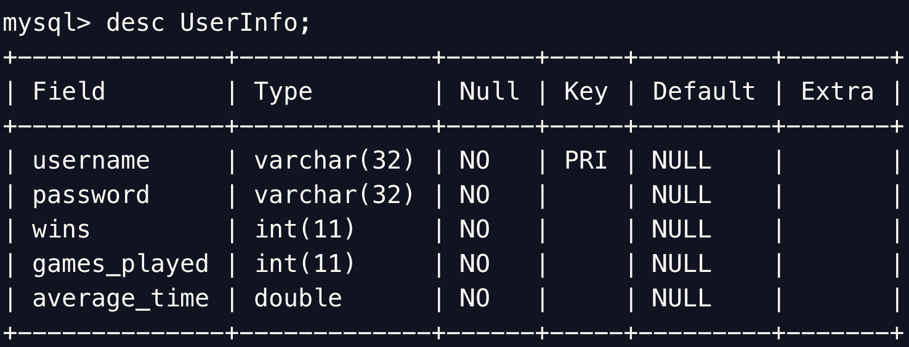
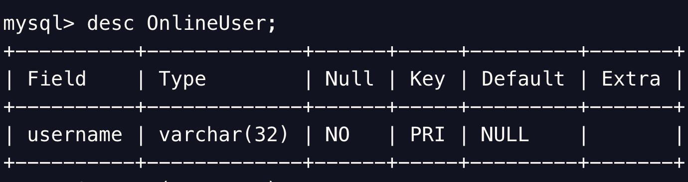
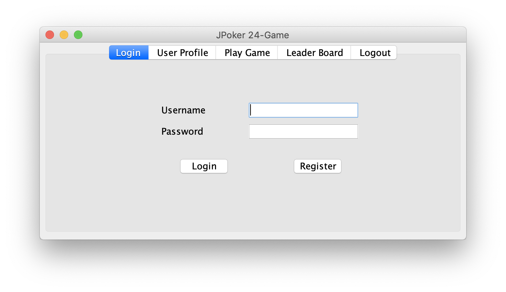
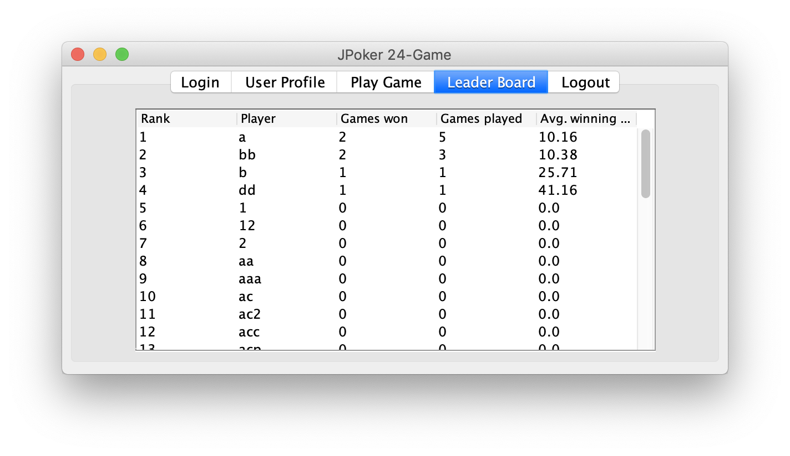
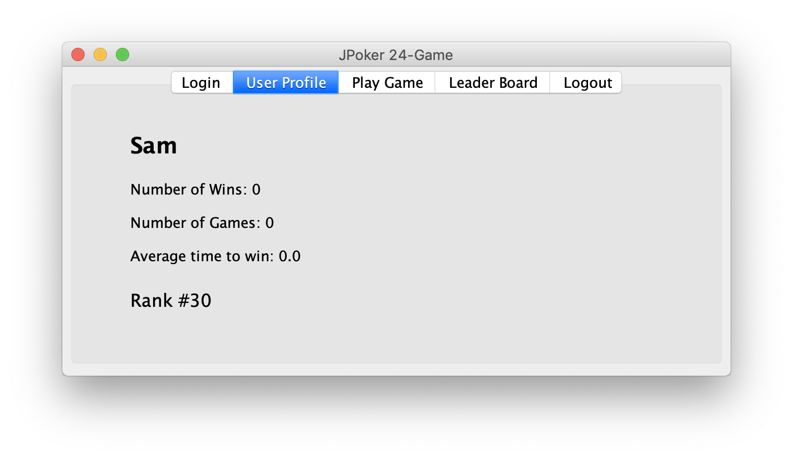
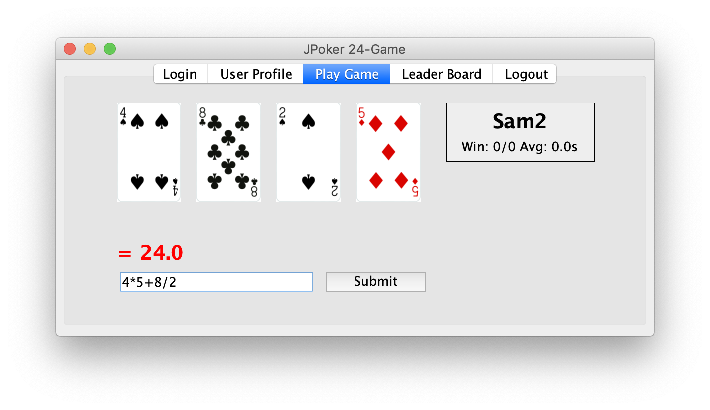
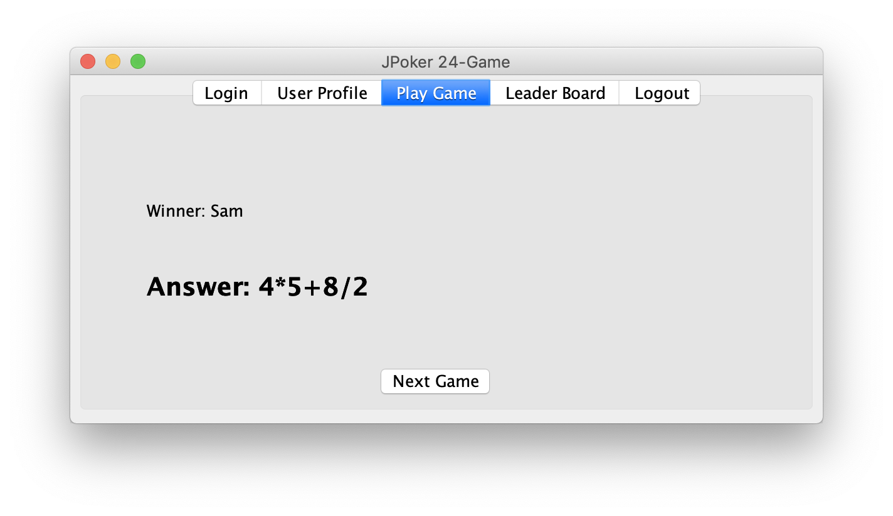

# 24 Card Game
The 24 Game is an arithmetical card game in which the objective is to find a way to manipulate four integers so that the end result is 24. It consists of:
* A server that handle user login, user matching, and gaming support;
* A client that allow users to login and play games.

## Game rules
* 4 Cards of different values are drawn
* Suit doesn’t matter
* Goal: an expression that equals 24
* Available operations: +, -, ×, ÷
* Parenthesis can be used to override precedence Fraction may appear in intermediate result

## Game structure
* RMI – handles user registration and login
* JDBC (MySQL) – handles data storage and retrieval 
* JMS (GlassFish) – handle client-server communication

## Setup
* Java 1.8
* GlassFish 5.0
  * Create connection factory `jms/JPoker24GameConnectionFactory`
  * Create topic `jms/JPoker24GameTopic`
  * Create queue `jms/JPoker24GameQueue`
* MySQL 8.0
  * Create database `c0402`

Start by running
```
asadmin start-domain
mysqld
rmiregistry &
```

## Database structure



## Screenshots





